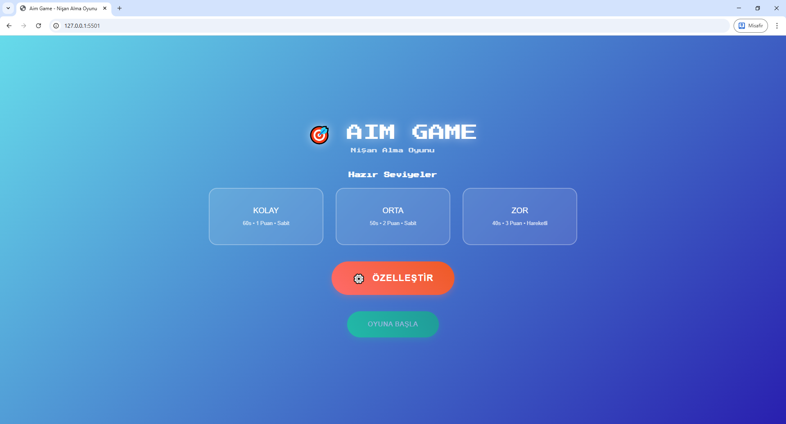
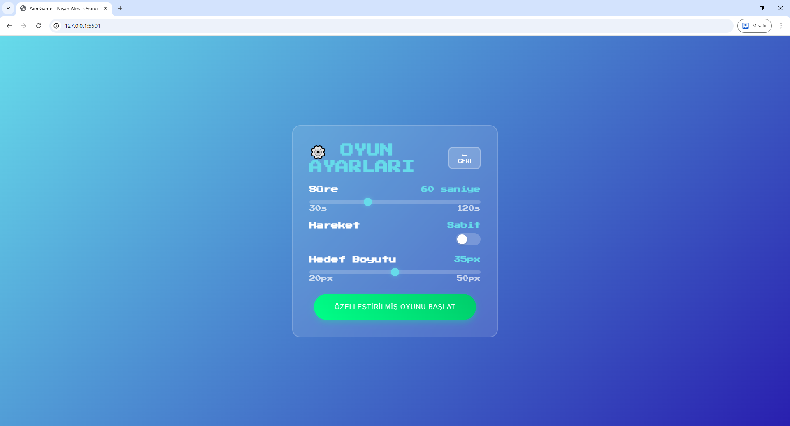
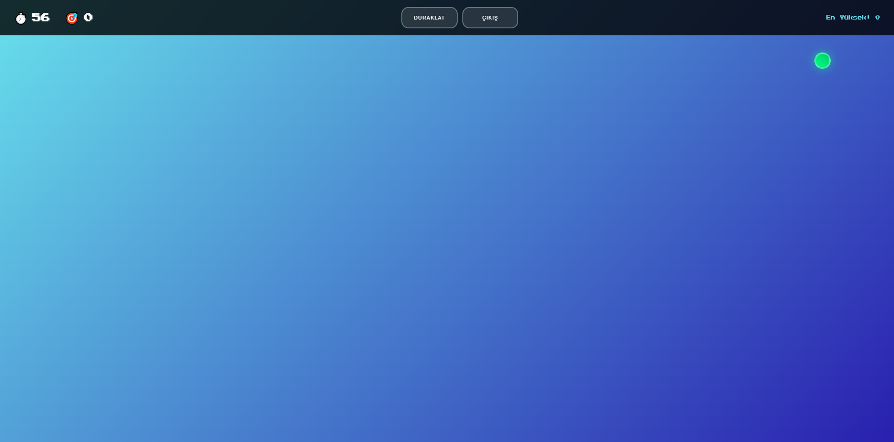
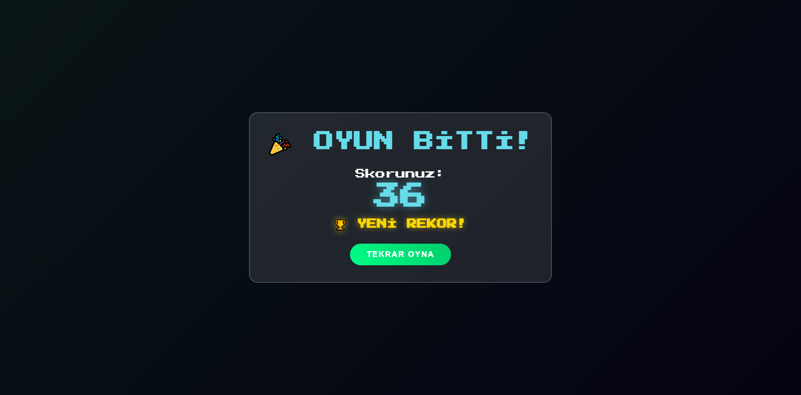

# Aim Game / Nişan Alma Oyunu
Modern ve basit bir nişan alma oyunu. Hedefleri vurun, skorunuzu artırın ve en yüksek skoru kırın!


## Özellikler


### 🛠️ Teknik Özellikler


- **HTML5**: Modern web standartları


- **CSS3**: Flexbox, Grid, Animations


- **Vanilla JavaScript**: Framework'süz, hızlı performans


- **LocalStorage**: Skor kaydetme


- **Responsive Design**: Tüm cihazlarda çalışır


### 🎮 Oyun Modları


- **Kolay**: 60 saniye, sabit hedefler, 35px boyut


- **Orta**: 50 saniye, sabit hedefler, 30px boyut  


- **Zor**: 40 saniye, hareketli hedefler, 25px boyut


- **Özelleştir**: Kendi ayarlarınızı belirleyin





#### *Özelleştirme seçenekleri*


- **Süre**: 30-120 saniye arası


- **Hareket**: Sabit veya hareketli hedefler


- **Hedef Boyutu**: 20-50px arası





### 🎨 Modern Tasarım


- Glassmorphism efektleri


- Retro oyun fontu (Press Start 2P)


- Canlı mavi renk teması


- Responsive tasarım (mobil uyumlu)


- Smooth animasyonlar




### 🎯 Skor Sistemi


- Gerçek zamanlı skor göstergesi


- En yüksek skor kaydetme (localStorage)


- Skor artışında animasyon efekti


- Yeni rekor bildirimi





## 🚀 Kurulum


### 1. Repository'yi Klonlayın:


```bash
git clone git@github.com:Cemrecicek/aimGame.git
cd aimGame
```


### 2. Oyunu Çalıştırın:


Web tarayıcısında `index.html` dosyasını açın:

**Windows:**


```bash
start index.html
```

**macOS:**


```bash
open index.html
```

**Linux:**


```bash
xdg-open index.html
```

### 3. Oyunu Test Edin:


Tarayıcıda oyun açılacak


- Bir zorluk seviyesi seçin (Kolay/Orta/Zor) veya "Özelleştir" butonuna basın


- "OYUNA BAŞLA" butonuna basarak oyunu başlatın


- Hedefleri tıklayarak skor kazanın ve en yüksek skoru kırın!